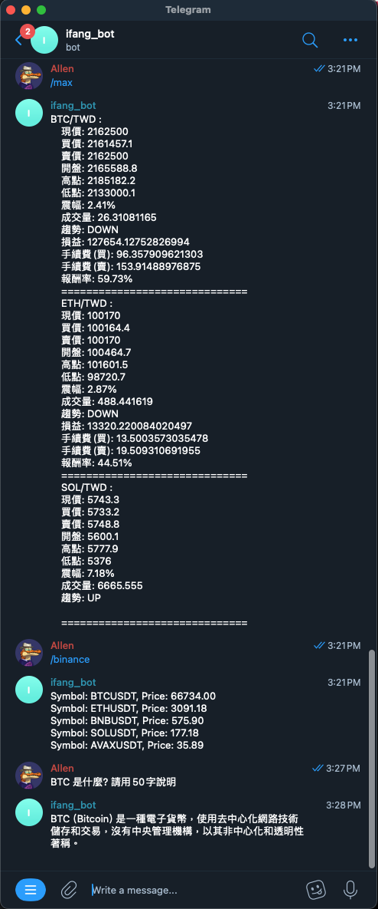

# telegram 實現 LLM 對話 , 以及 binance 和 max 平台 查詢幣價

## 安裝 ollama

### macOS

[Download](https://ollama.com/download/Ollama-darwin.zip)

### Windows

[Download](https://ollama.com/download/OllamaSetup.exe)

### Linux

```
curl -fsSL https://ollama.com/install.sh | sh
```

## 下載 model 

```sh
ollama run gemma
```

## 向 chatfather 申請一個 chatbot 並按照步驟拿到 TOKEN


## 啟動服務

```sh
npm install
node server.js
```

## 使用Ngork (代理外網)

```sh
./ngork http 4040
```


## 設定Telegram Webhook

```sh
curl https://api.telegram.org/bot{$token}/setWebhook?url={$ngrok_url}
```


## 完成~


